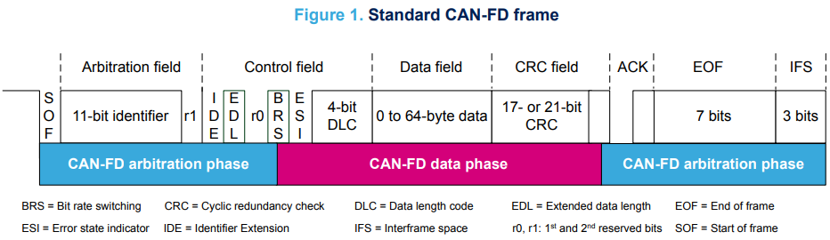

# CAN FD - What is it and how it works ?

CAN FD (**C**ontroller **A**rea **N**etwork **F**lexible **D**ata-Rate) is a **data-communication protocol** used for broadcasting sensor data and control information on 2 wire interconnections between different parts of electronic instrumentation and control system. In a CAN (FD) each device that can send/receive CAN messages is called a **Node**. Here is what a CAN network looks like :

CAN FD is an **extension** to the original CAN bus protocol that was specified in ISO 11898-1. CAN FD is the second generation of CAN protocol developed by **Bosch**.

In this doc I will not talk about the differences between CAN and CAN FD, I will only explain CAN FD. All you have to retain is that CAN FD has a **better data transfer rate** and can transmit **more data by message**.

### Dominant and recessive bits

Important thing to know before seeing what is inside a FD CAN Frame is how bits are transmitted. CAN uses his 2 wires to transmit bit with a differential of tension between the two wires.

### The FD CAN Frame

As you can see the FDCAN frame is divided into three main phases:

#### The arbitration phase

**SOF** (**S**tart **O**f **F**rame) : A single dominant bit (0). It allows the node to synchronise on the start of the frame.

11-bit **Identifier** : It's the identifier of the message, it determine the priority of the message, the lower it is, the higher the priority.

r1 : A dominant (0) bit, he is here for future evolution of the protocol.

**IDE** (**I**dentifier **E**xtension) : Idicate if the frame use 11 bit identifier (0) or 29 bits (1).
r0 : Same as r1.

**EDL** (**E**xtended **D**ata **L**ength) : Indicate that the frame is a FD CAN frame with a recessive bit (1). It is a dominant bit (0)  if it's a classic CAN frame.

**BRS** (**B**it **R**ate **S**witching) : If this bit is recessive (1) the bit rate of the data phase will be higher.

#### The data phase

**DLC** (**D**ata **L**ength **C**ode) : Indicate the size of the payload of the message.

**Data** field : The 1 to 64 bytes of payload.

**CRC** (**C**ycle **R**edundancy **C**heck) : 17 or 21 bits (depending on payload size) that forms a code to verifiy data integrity. THe receiverf calculate CRC with the frame and if the two CRC aren't the same, the frame is rejected.

**ACK** (**A**cknowledgment) :  The transmitter sends a recessive bit. Any receiver that has correctly received the frame overwrites this bit with a dominant bit, confirming correct reception. If no one acknowledges, the transmitter knows there is a problem.

**EOF** (**E**nd **O**f **F**rame) : 7 recessive bits that marks the end of the frame.

**IFS** (**I**nterframe **S**pace) : 3 bits of pause between two frames, to give nodes time to process the received frame before the next one.