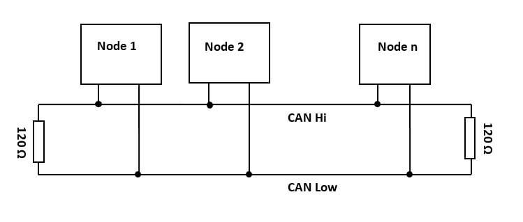
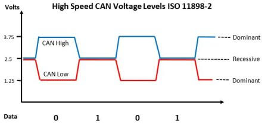
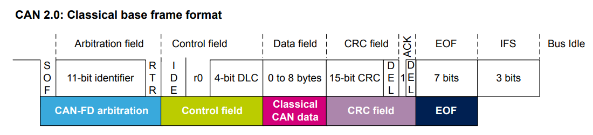

# CAN - What is it and how it works?
CAN (**C**ontroller **A**rea **N**etwork) is a **data-communication protocol** used for broadcasting sensor data and control information on 2 wire interconnections between different parts of electronic instrumentation and control system. In a CAN each device that can send/receive CAN messages is called a **Node**. Here is what a CAN network looks like:

The CAN protocol was originally invented by **Bosch** in 1983, since then they released several version of the protocol. The latest version are **CAN 2.0-A** and **CAN 2.0B** released in 1991.

Note: What changes between CAN 2.0A and CAN 2.0B is the size of the **identifier**, **11 bits** for **CAN 2.0A** and **29 bits** for **CAN 2.0B**.

### Dominant and recessive bits

Important thing to know before seeing what is inside a CAN Frame is how bits are transmitted. CAN uses its 2 wires to transmit bits with a voltage difference between the two wires. When a node detects a **positive voltage of 2.5V** between the wires it understands it as a **0** (or **dominant bit**) and when the voltage difference is **zero** it understands it as a **1** (or **recessive bit**).

## The CAN Frame

**SOF** (**S**tart **O**f **F**rame): A dominant bit (0) to **synchronize** all of the nodes.

**11-bit Identifier**: It's the identifier of the message, it determines the **priority** of the message, the lower it is, the higher the priority.

**RTR** (**R**emote **T**ransmission **R**equest): When dominant (0) it indicates that the frame is a **data frame**, i.e. meant to send data to the other nodes. When recessive (1) it indicates that the frame is a **remote frame**, i.e. a frame that's asking another node for data (without it sending one).

### Control field

**IDE** (**I**dentifier **E**xtension): Indicates the length of the identifier. Dominant (0) for **standard** (11 bits) and Recessive (1) for **extended** (29 bits).

r0: A **reserved** bit always dominant (0).

**DLC** (**D**ata **L**ength **C**ode): 4 bits that indicates the **size** in bytes of the **data field** (goes from 0 to 8).

### Data field

Data: The 0 to 8 bytes of **payload**.

### CRC field

**CRC** (**C**yclic **R**edundancy **C**heck): 15 bits that form a code to verify **data integrity**. The receiver calculates CRC with the frame and if the two CRCs don't match, the frame is rejected.

**DEL** (CRC **Del**imiter): A recessive (1) bit that marks the end of **CRC**.

**ACK**: The sender puts a recessive bit (1) here and the receiver **overwrites** it with a dominant bit (0) to confirm reception.

### EOF field

**EOF** (**E**nd **O**f **F**rame): 7 recessive bits (1) that **mark the end of the frame**.

**IFS** (**I**nter**F**rame **S**pace): 3 separation bits to **separate consecutive frames**.
